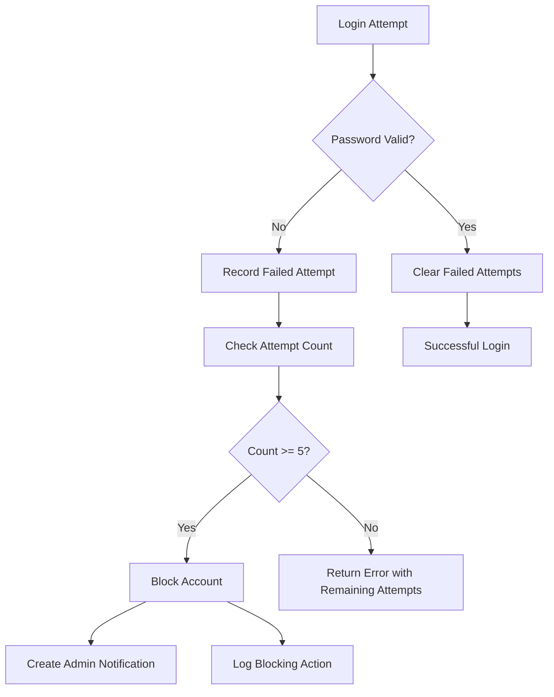
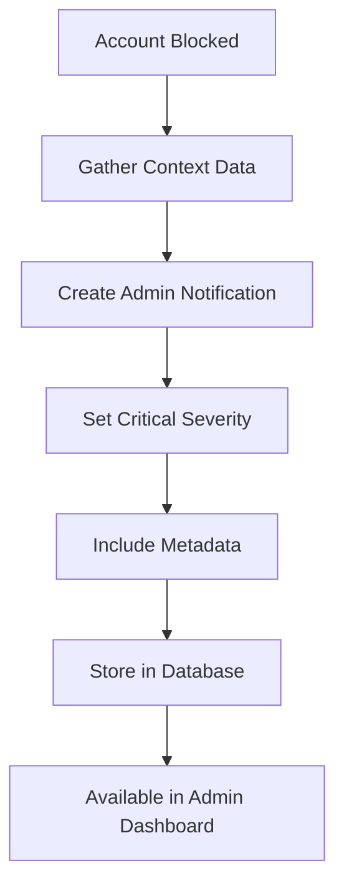
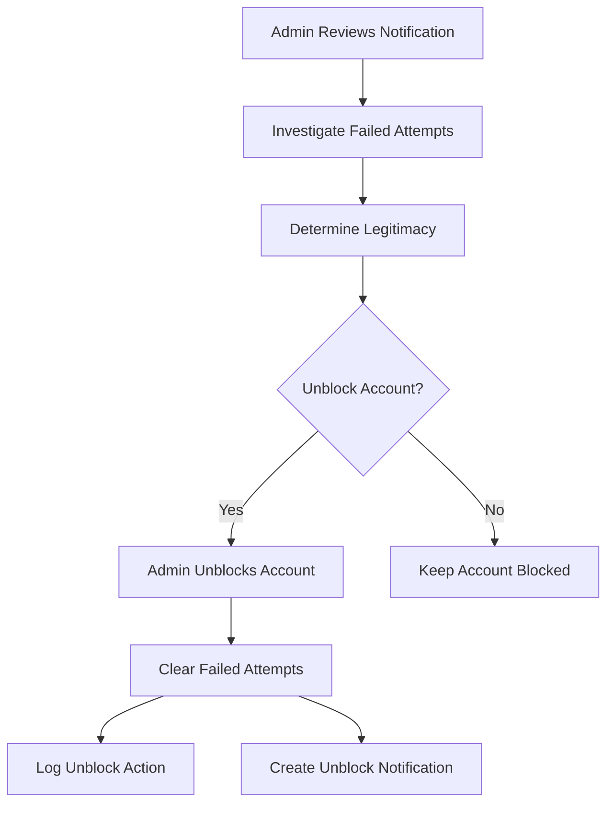

# 🔒 Rate Limiting & Account Security System

## Overview
This document describes the comprehensive rate limiting system implemented for SentinelVault that automatically blocks accounts after 5 consecutive failed login attempts and notifies administrators for immediate review.

## 🎯 System Features

### Automatic Account Blocking
- **Threshold**: 5 consecutive failed login attempts within 1 hour
- **Action**: Immediate account blocking with database flag update
- **Duration**: 24-hour lockout period (admin can override)
- **Scope**: Per email address across all IP addresses and devices

### Admin Notification System
- **Real-time Alerts**: Instant notification creation when account is blocked
- **Severity Classification**: Critical severity for immediate admin attention
- **Detailed Context**: Failed attempt history, IP addresses, locations, risk scores
- **Notification Management**: Read/unread status tracking with timestamps

### Comprehensive Logging
- **Failed Attempt Tracking**: Every failed login recorded with full context
- **Risk Score Integration**: Failed attempts contribute to overall risk assessment
- **Audit Trail**: Complete history of blocking/unblocking actions
- **Data Retention**: Failed attempts auto-expire after 24 hours

## 🏗️ Technical Architecture

### Database Models

#### FailedLoginAttempt Model
```typescript
interface IFailedLoginAttempt {
  email: string;              // User email address
  ipAddress: string;          // Source IP address
  userAgent?: string;         // Browser/client information
  deviceFingerprint?: string; // Device identification
  location?: string;          // Geographic location
  timestamp: Date;            // Attempt timestamp
  reason: string;             // Failure reason
  riskScore?: number;         // Associated risk score
}
```

#### AdminNotification Model
```typescript
interface IAdminNotification {
  type: 'account_blocked' | 'security_alert' | 'system_alert';
  title: string;              // Notification title
  message: string;            // Detailed message
  severity: 'low' | 'medium' | 'high' | 'critical';
  userId?: ObjectId;          // Associated user ID
  userEmail?: string;         // User email for reference
  metadata?: {                // Additional context
    failedAttempts?: number;
    ipAddress?: string;
    location?: string;
    riskScore?: number;
    blockReason?: string;
  };
  isRead: boolean;            // Read status
  createdAt: Date;            // Creation timestamp
  readAt?: Date;              // Read timestamp
}
```

### Rate Limiter Service

#### Core Functionality
```typescript
class RateLimiterService {
  private readonly MAX_FAILED_ATTEMPTS = 5;
  private readonly LOCKOUT_DURATION = 24 * 60 * 60 * 1000; // 24 hours
  private readonly ATTEMPT_WINDOW = 60 * 60 * 1000; // 1 hour window

  // Record failed attempt with full context
  async recordFailedAttempt(attemptData: FailedAttemptData): Promise<void>
  
  // Check if account should be blocked
  private async checkAndBlockAccount(email: string, ipAddress: string): Promise<void>
  
  // Block account and notify admin
  private async blockAccount(email: string, ipAddress: string, failedAttempts: number): Promise<void>
  
  // Get current failed attempts count
  async getFailedAttemptsCount(email: string): Promise<number>
  
  // Check rate limit status
  async isAccountRateLimited(email: string): Promise<RateLimitStatus>
  
  // Clear failed attempts on successful login
  async clearFailedAttempts(email: string): Promise<void>
}
```

## 🔄 Rate Limiting Flow

### 1. Failed Login Detection


### 2. Admin Notification Flow


### 3. Account Recovery Flow


## 🛡️ Security Features

### Multi-Layer Protection
1. **Rate Limiting**: Prevents brute force attacks
2. **Account Blocking**: Stops persistent attackers
3. **Admin Oversight**: Human review for security decisions
4. **Audit Logging**: Complete trail of security events
5. **Risk Integration**: Failed attempts increase risk scores

### Attack Prevention
- **Brute Force**: Automatic blocking after 5 attempts
- **Credential Stuffing**: Cross-device attempt tracking
- **Distributed Attacks**: Per-email blocking regardless of IP
- **Persistent Attackers**: 24-hour lockout periods
- **Social Engineering**: Admin verification required for unblocking

## 📊 Admin Management Interface

### Security Dashboard Features
- **Blocked Accounts Overview**: Count and list of blocked accounts
- **Failed Attempts Statistics**: 24-hour and 7-day metrics
- **Top Failing IPs**: Most frequent attack sources
- **Recent Notifications**: Latest security alerts
- **Rate Limit Configuration**: Current system settings

### Notification Management
- **Real-time Alerts**: Immediate notification of blocked accounts
- **Severity Indicators**: Visual priority classification
- **Detailed Context**: Full attempt history and metadata
- **One-click Actions**: Mark as read, unblock account
- **Bulk Operations**: Manage multiple notifications

### Account Unblocking
- **User Identification**: Find blocked accounts by email
- **Attempt History**: Review failed login patterns
- **Reason Requirement**: Mandatory justification for unblocking
- **Audit Trail**: Log all unblock actions with admin details
- **Immediate Effect**: Instant account reactivation

## 🔧 API Endpoints

### Authentication Endpoints
```typescript
// Enhanced login with rate limiting
POST /api/auth/login-comprehensive
{
  "email": "user@example.com",
  "password": "password123"
}

// Response for rate limited account
HTTP 429 Too Many Requests
{
  "error": "Account temporarily locked",
  "message": "Too many failed login attempts. Account has been blocked and admin has been notified.",
  "rate_limit": {
    "attempts_made": 5,
    "max_attempts": 5,
    "blocked": true
  }
}
```

### Admin Management Endpoints
```typescript
// Get admin notifications
GET /api/admin/notifications
Authorization: Bearer <admin_token>

// Mark notification as read
PATCH /api/admin/notifications/:id/read
Authorization: Bearer <admin_token>

// Get failed attempts for user
GET /api/admin/users/:userId/failed-attempts
Authorization: Bearer <admin_token>

// Unblock user account
POST /api/admin/users/:userId/unblock
Authorization: Bearer <admin_token>
{
  "reason": "Legitimate user verified via phone call"
}

// Get rate limiting statistics
GET /api/admin/rate-limit-stats
Authorization: Bearer <admin_token>
```

## 📈 Monitoring & Analytics

### Key Metrics
- **Blocked Accounts**: Total number of currently blocked accounts
- **Failed Attempts**: Count of failed attempts in last 24 hours/7 days
- **Attack Patterns**: Most common failure reasons and sources
- **Response Times**: Admin notification and unblock response times
- **False Positives**: Legitimate users accidentally blocked

### Alert Thresholds
- **Critical**: Account blocked (immediate admin attention)
- **High**: 4 failed attempts (warning threshold)
- **Medium**: Unusual login patterns detected
- **Low**: System configuration changes

## 🧪 Testing & Validation

### Automated Testing
Use the `test-rate-limiting.html` interface to validate:

1. **User Registration**: Create test account
2. **Failed Attempts**: Make 5 consecutive failed login attempts
3. **Account Blocking**: Verify account is blocked after 5th attempt
4. **Admin Notification**: Check notification is created with correct details
5. **Account Recovery**: Test admin unblock functionality

### Test Scenarios
```javascript
// Test Case 1: Basic Rate Limiting
- Register user: ratelimit@example.com
- Make 5 failed login attempts with wrong password
- Verify account is blocked on 5th attempt
- Check admin notification is created

// Test Case 2: Admin Recovery
- Login as admin
- View blocked account notifications
- Unblock the test account with reason
- Verify account can login again

// Test Case 3: Attempt Clearing
- Make 3 failed attempts
- Login successfully with correct password
- Verify failed attempts are cleared
- Confirm account is not blocked
```

### Expected Results
- ✅ Account blocked after exactly 5 failed attempts
- ✅ Admin notification created with critical severity
- ✅ Failed attempts cleared on successful login
- ✅ Admin can unblock accounts with audit trail
- ✅ Rate limit status properly tracked and reported

## 🔒 Security Considerations

### Data Protection
- **PII Handling**: Email addresses encrypted in notifications
- **IP Privacy**: IP addresses logged for security but not exposed
- **Audit Compliance**: All actions logged for regulatory requirements
- **Data Retention**: Failed attempts auto-expire after 24 hours

### Attack Mitigation
- **Timing Attacks**: Consistent response times regardless of user existence
- **Information Disclosure**: Generic error messages to prevent enumeration
- **Bypass Prevention**: Rate limiting applied before password verification
- **Admin Protection**: Admin accounts have separate rate limiting rules

## 🚀 Future Enhancements

### Advanced Features
1. **Adaptive Thresholds**: Dynamic rate limits based on risk scores
2. **Geographic Blocking**: Location-based rate limiting rules
3. **Behavioral Analysis**: Pattern recognition for sophisticated attacks
4. **Integration APIs**: Webhook notifications for external security systems
5. **Machine Learning**: Automated threat detection and response

### Scalability Improvements
1. **Redis Integration**: Distributed rate limiting across multiple servers
2. **Database Optimization**: Efficient indexing for high-volume environments
3. **Async Processing**: Background notification and logging systems
4. **Load Balancing**: Rate limiting coordination across server clusters

This comprehensive rate limiting system provides enterprise-grade protection against brute force attacks while maintaining usability for legitimate users and providing administrators with the tools needed for effective security management.